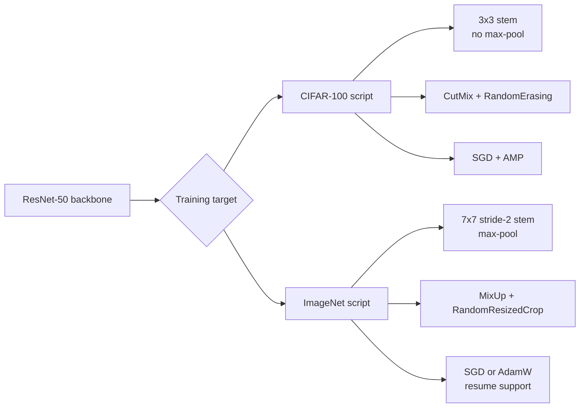

# ResNet50 For CIFAR-100 And ImageNet2012


Two standalone PyTorch training scripts built around ResNet-50:

- `resnet50_cifar100.py` for CIFAR-100
- `resnet50_imagenet.py` for ImageNet-1K / ImageNet2012

The goal of this repo is to keep the full training logic readable while still using practical modern training tricks.

## Setup

```bash
python -m venv .venv
# Windows
.venv\Scripts\activate
# macOS / Linux
# source .venv/bin/activate

pip install -r requirements.txt
```

## Quick Start

### CIFAR-100

```bash
python resnet50_cifar100.py
```

- CIFAR-100 is downloaded automatically
- default data path: `./data`
- override with `CIFAR100_DATA_DIR`
- default outputs: `outputs/checkpoints/` and `outputs/runs/`

### ImageNet

```bash
python resnet50_imagenet.py
```

By default the script expects:

```text
data/imagenet/train
data/imagenet/val
```

You can override dataset paths with `IMAGENET_TRAIN_DIR` and `IMAGENET_VAL_DIR`.

## Implementation Highlights

Shared ideas in both scripts:

- ResNet-50 built from bottleneck residual blocks
- stochastic depth, label smoothing, warmup cosine scheduling, AMP, checkpoint saving, TensorBoard logging, and optional `DataParallel`

`resnet50_cifar100.py` focuses on small-image training:

- CIFAR-style `3x3` stem with no initial max-pool
- CutMix, ColorJitter, RandomHorizontalFlip, and RandomErasing
- SGD with momentum

`resnet50_imagenet.py` keeps the standard ImageNet setting:

- standard `7x7` stride-2 stem plus max-pool
- RandomResizedCrop, MixUp, ColorJitter, RandomHorizontalFlip, and RandomErasing
- SGD or AdamW, checkpoint resume logic, and top-1 / top-5 evaluation

## Visual Summary



The two scripts share the same ResNet-50 idea but diverge where the dataset scale changes. The CIFAR version is adapted for small `32x32` inputs, while the ImageNet version keeps the standard large-scale recipe.

## License

MIT
